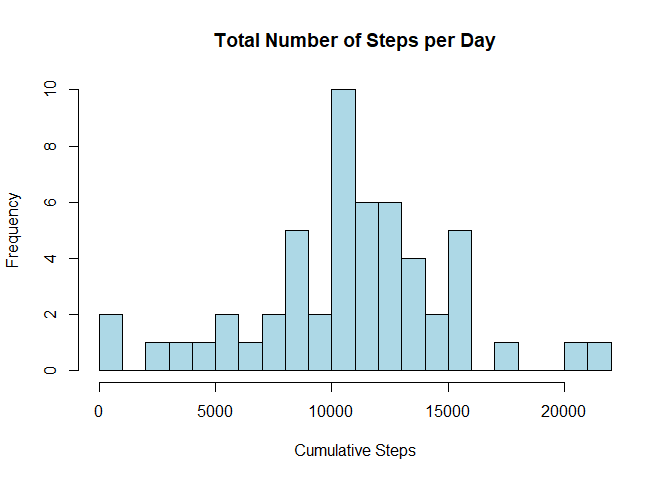

Reproducible Research: Assignment 1
===================================

##Loading and preprocessing data

1. Load necessary libraries.

```r
library(plyr)
library(dplyr)
library(lattice)
```

2. Download and load the data.

```r
download.file("https://d396qusza40orc.cloudfront.net/repdata%2Fdata%2Factivity.zip","data.zip")
unzip("data.zip")

data<-read.csv("activity.csv")
```

3. Clean the data.

```r
data$date<-as.Date(data$date)
dataClean<-data[!is.na(data$steps),]
```


##What is mean total number of steps taken per day?

1. Calculate the total number of steps taken per day.

```r
totalSteps1<-select(dataClean,date,steps)%>%
    group_by(date)%>%
    summarize(steps=sum(steps))
```

2. Make a histogram of the total number of steps taken each day.

```r
with(totalSteps1,hist(steps,breaks=20,col="lightblue",
                     main="Total Number of Steps per Day", 
                     xlab="Cumulative Steps"))
```

<!-- -->

3. Calculate and report the mean and median of the total number of steps taken per day.

```r
totalSteps1_mean<-mean(totalSteps1$steps)
totalSteps1_median<-median(totalSteps1$steps)
```

- The mean total number of steps taken per day is 1.0766189\times 10^{4} steps.
- The median total number of steps taken per day is 10765 steps.


##What is the average daily activity pattern?

1. Make a time series plot of the 5-minute interval and the average number of steps taken, averaged across all days.

```r
averageSteps1<-select(dataClean,interval,steps)%>%
    group_by(interval)%>%
    summarize(steps=mean(steps))

with(averageSteps1,plot(interval,steps,type="l",xlab="TIme Interval",ylab="Avg. Steps",
     main="Time Series Plot of Avg Steps in 5-minute Intervals"))
```

<!-- -->

2. Which 5-minute interval, on average across all the days in the dataset, contains the maximum number of steps?

```r
averageStepsMax<-averageSteps1[which.max(averageSteps1$steps),]
```

- The 5-minute interval containing the maximum number of steps is 835.


##Imputing missing values

1. Calculate and report the total number of missing values in the dataset.

```r
dataNAs<-is.na(data)
dataNAs_sum<-sum(dataNAs)
```

2. Devise a strategy for filling in all of the missing values in the dataset.

```r
stepsFill<-function(steps,interval){
    filled<-NA
    if(!is.na(steps)) filled<-steps
    else filled<-(averageSteps1[averageSteps1$interval==interval,"steps"])
    return(filled)
}
```

3. Create a new dataset that is equal to the original dataset but with the missing data filled in.

```r
dataFilled<-mutate(data,steps=as.numeric(mapply(FUN=stepsFill,steps,interval)))
```

4. Make a histogram of the total number of steps taken each day.

```r
totalSteps2<-select(dataFilled,date,steps)%>%
    group_by(date)%>%
    summarize(steps=sum(steps))

with(totalSteps2,hist(steps,breaks=20,col="lightblue",
                     main="Total Number of Steps per Day", 
                     xlab="Cumulative Total Number of Steps"))
```

<!-- -->

5. Calculate and report the mean and median total number of steps taken per day.

```r
totalSteps2_mean<-mean(totalSteps2$steps)
totalSteps2_median<-median(totalSteps2$steps)
```

- The mean total number of steps taken per day is 1.0766189\times 10^{4} steps.
- The median total number of steps taken per day is 1.0766189\times 10^{4} steps.
- These values are very similar to the first estimates from the first section of the assignment.
- The impact of including the missing data (using the mean to calculate the values), appears to mostly just be to increase the spread of the dataset.


##Are there differences in activity patterns between weekdays and weekends?

1. Create a new factor variable in the dataset indicating whether a given date is a weekday or weekend day.

```r
findDateType<-function(date){
    if (date %in% c("Saturday", "Sunday"))
        return("Weekend")
    else return("Weekday")
}
dataFilled_expansion<-mutate(dataFilled,dateType=weekdays(date))%>%
    mutate(dateType=as.factor(sapply(dateType,FUN=findDateType)))
```

2. Make a panel plot containing a time series plot of the 5-minute interval and the average number of steps taken, averaged across all weekday days or weekend days.

```r
averageSteps2<-select(dataFilled_expansion,dateType,interval,steps)%>%
    group_by(dateType,interval)%>%
    summarize(steps=mean(steps))

xyplot(steps~interval|dateType,data=averageSteps2,type="l",layout=c(1,2),
       ylab="Avg. Steps",xlab="Time Interval",main="Time Series Plot of Avg Steps in 5-minute Intervals")
```

<!-- -->

#Appendix

```r
sessionInfo()
```

```
R version 3.4.1 (2017-06-30)
Platform: x86_64-w64-mingw32/x64 (64-bit)
Running under: Windows 10 x64 (build 15063)

Matrix products: default

locale:
[1] LC_COLLATE=English_United States.1252 
[2] LC_CTYPE=English_United States.1252   
[3] LC_MONETARY=English_United States.1252
[4] LC_NUMERIC=C                          
[5] LC_TIME=English_United States.1252    

attached base packages:
[1] stats     graphics  grDevices utils     datasets  methods   base     

other attached packages:
[1] bindrcpp_0.2    lattice_0.20-35 dplyr_0.7.3     plyr_1.8.4     

loaded via a namespace (and not attached):
 [1] Rcpp_0.12.12     assertthat_0.2.0 digest_0.6.12    rprojroot_1.2   
 [5] grid_3.4.1       R6_2.2.2         backports_1.1.0  magrittr_1.5    
 [9] evaluate_0.10.1  rlang_0.1.2      stringi_1.1.5    rmarkdown_1.6   
[13] tools_3.4.1      stringr_1.2.0    glue_1.1.1       yaml_2.1.14     
[17] compiler_3.4.1   pkgconfig_2.0.1  htmltools_0.3.6  bindr_0.1       
[21] knitr_1.17       tibble_1.3.4    
```
